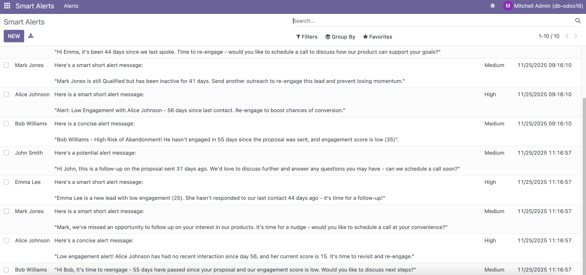

# Smart Alerts AI – JJungles CRM Microservice
<p align="center">
  
</p>

[]()
[]()
[]()
[]()
[]()
[]()
[]()


## Project Description

Smart Alerts AI – JJungles CRM Microservice is an intelligent alerts engine designed to enhance CRM workflows by analyzing lead data and generating real-time AI-driven insights.

This microservice:

- Reads and validates a leads CSV file
- Calculates lead metrics and prioritization
- Uses Ollama + Llama 3.2 (3B) to generate personalized alert messages
- Returns enriched CRM insights via a clean FastAPI REST API

It was built to help sales teams identify high-priority leads, automate follow-ups, and improve customer engagement.

## Prerequisites

### Install Python 3.10+
```bash
python3 --version
```

### Install Ollama
macOS / Linux:
```bash
curl -fsSL https://ollama.com/install.sh | sh
```

Windows:
Download from Ollama website.

### Pull the required model
```bash
ollama pull llama3.2:3b
```

## Architecture Overview

<p align="center">
  
</p>

## Technologies Used

- Python 3.10+
- FastAPI
- Ollama
- Llama 3.2 – 3B
- Pandas
- Pydantic
- Standard Logging

## Installation & Usage

### Clone the repository
```bash
git clone https://github.com/victoradearaujo/ai_microservice.git
cd smart-alerts-ai
```

### Create virtual environment
```bash
python3 -m venv venv
source venv/bin/activate
```

### Install dependencies
```bash
pip install -r requirements.txt
```

### Run the API
```bash
uvicorn app:app --reload
```
### Run localhost
```bash
http://127.0.0.1:8000/docs
```

## Project Structure
```
smart-alerts-ai/
│
├── app.py
├── leads.csv
├── requirements.txt
└── README.md
```

## API Endpoints & Examples

### Health Check
```json
{ "message": "JJungles Smart Alerts API is running" }
```

### Smart Alerts Example Response
```json
{
  "alerts": [
    {
      "lead_name": "John Doe",
      "last_contacted": "2024-01-10",
      "engagement_score": 42,
      "stage": "Negotiation",
      "days_since_last_contacted": 12,
      "priority": "Medium Priority",
      "ai_alert": "AI-generated message..."
    }
  ]
}
```
<p align="center">
  
</p>

<p align="center">
  
</p>

## Environment Variables
```
MODEL_NAME=llama3.2:3b
CSV_FILE=leads.csv
LOG_LEVEL=INFO
```
# Step 2 – Odoo 16 Integration

This section covers the integration of the **Smart Alerts AI Microservice** with **Odoo 16**, allowing automatic fetching and display of smart alerts in the Odoo backend.

---

### Module Structure

```
    
 addons/jj_smart_alerts/
│── __init__.py
│── __manifest__.py
│── security/
│ └── ir.model.access.csv
│── models/
│ └── __init__.py
│ └── smart_alert.py
│── views/
│ └── smart_alerts_views.xml
│── data/
│ └── cron_job.xml
```


- `security/ir.model.access.csv` → actions control access
- `models/smart_alert.py` → defines the `jj.smart.alert` model and the `fetch_from_api` method.  
- `views/smart_alerts_views.xml` → contains the **tree and form views** and menu entries.  
- `data/cron_job.xml` → defines the **scheduled action** to automatically fetch alerts.  

---

###  1 - Install the Module

1. Copy the `jj_smart_alerts` folder into your Odoo `addons` directory.  
2. Activate **Developer Mode** in Odoo.  
3. Go to **Apps** → click **Update Apps List** → search for `JJ Smart Alerts`.  
4. Click **Install**.

> After installation, a **Smart Alerts menu** will appear in the backend (Smart Alerts → Alerts)

---

### 2 - Configure Cron Job (Scheduled Action)

You can use the XML file (`cron_job.xml`) or configure it manually:

**Manual steps:**

1. Go to **Settings → Technical → Automation → Scheduled Actions**.  
2. Click **NEW**:
   - **Name:** Fetch Smart Alerts  
   - **Model:** Smart Alerts (`jj.smart.alert`)  
   - **Method:** `fetch_from_api`  
   - **Interval Number:** 2  
   - **Interval Unit:** Hours  
   - **Number of Calls:** -1 (infinite)  
   - **Active:** Checked  
3. Save the cron.

> Optional for testing: set Interval Number = 5 and Interval Unit = Minutes to see alerts in real-time.

---

### 3 - Test the Integration

1. Make sure your **Smart Alerts API** is running.  
2. Manually execute the cron job:
   - **Settings → Technical → Automation → Scheduled Actions → Fetch Smart Alerts → Run Manually**
3. Check the **Smart Alerts menu**:
   - The list should populate with alerts from your API.  
   - Fields shown: Lead, Alert Message, Priority, Generated At.

---

### 4 - Example Output in Odoo

| Lead         | Alert Message                                    | Priority | Generated At          |
|--------------|-------------------------------------------------|----------|----------------------|
| Emma Lee     | Low engagement. Suggest a follow-up call.      | High     | 2025-11-25 11:00:00  |
| Mark Jones   | Moderate engagement. Review next step.         | Medium   | 2025-11-25 11:00:00  |

<p align="center">
  
</p>

---

### 5 - Notes

- The cron ensures that your Smart Alerts are **always up-to-date** without manual intervention.  
- Duplicate alerts are prevented by checking `lead_name` + `alert_message` before creating new records.  
- For troubleshooting, always check the **Odoo server logs** and make sure the **API URL** is reachable from the Odoo container.

---
# Docker Setup Odoo 16 + PostgreSQL + pgAdmin Setup 

This repository contains a simple **Docker Compose** configuration to spin up a local development environment with:

- **Odoo 16**: Open-source business apps management
- **PostgreSQL 14**: Open-source relational database
- **pgAdmin 4**: Web interface for managing PostgreSQL

## What's Included

- Odoo 16 image
- PostgreSQL image
- pgAdmin 4 image
- Persistent storage via Docker volumes
- Configurable environment variables
- Exposed ports for easy access

### 1 - Start the Services

```bash
docker-compose up -d
```

This will:

- Create and run the containers
- Set up persistent data volumes
- Expose the following ports:
  - Odoo 16: `localhost:8069`
  - PostgreSQL: `localhost:5432`
  - pgAdmin: `localhost:5050`

---
### 2 - pgAdmin 4

1. Open your browser and go to: [http://localhost:5050](http://localhost:5050)
2. Login:
   - **Email**: `admin@gmail.com`
   - **Password**: `admin123@`
3. After login, click **"Add New Server"** and configure:
   - **General**: `Name: Odoo DB`
   - **Connection**: `Host: db` 
   - **Port**: `5432`
   - **Username**: `admin`
   - **Password**: `admin123@`
---
### 3 - Odoo 16
1. Open your browser and go to: [http://localhost:8069](http://localhost:8069)
2. Create A New Database:
   - **Database Name**: `odoo16`
   - **Email**: `admin@gmail.com`
   - **Password**: `admin123@`
   - **Language**: `English`
   - **Load Demo Data**: `Check` 
   - **Country**: `Australia`

---
   
## Data Volumes

- `./addons:/mnt/extra-addons` → Odoo data files
- `.odoo16-db-data:/var/lib/postgresql/data` → PostgreSQL data files
- `.pgadmin-data:/var/lib/pgadmin` → pgAdmin configuration

> These folders are listed in `.gitignore` to prevent them from being tracked by Git.

## Stop the Services

```bash
docker-compose down
```

> To remove all volumes and data as well:
```bash
docker-compose down -v
```

---

## Requirements

- Docker installed: https://www.docker.com/
- Docker Compose (included in recent Docker Desktop versions)

---

## Notes

- This setup is for local development only. Do **not** use these credentials in production.
- You can change all environment variables in the `docker-compose.yml` file.
- Data persists even after containers are stopped.

## License
MIT License

## Contributing
1. Fork this repository
2. Create a feature branch
3. Commit changes
4. Open PR

## Gitflow
main → production  
develop → active development  
