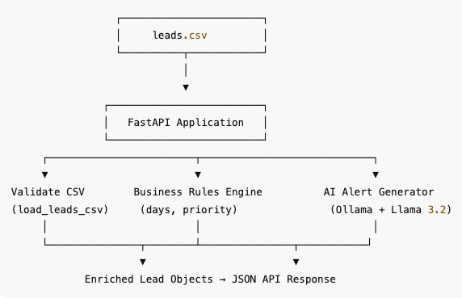
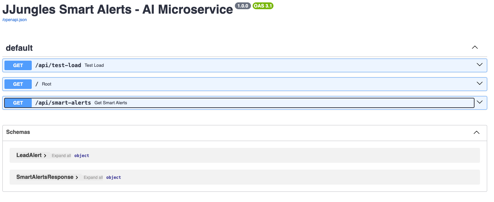
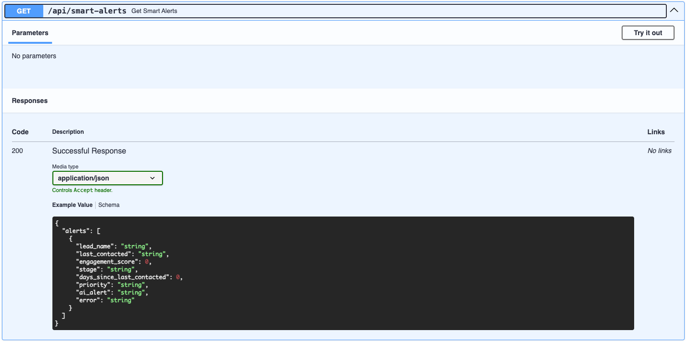

# Smart Alerts AI – JJungles CRM Microservice
<p align="center">
  
</p>

[]()
[]()
[]()

## Project Description

Smart Alerts AI – JJungles CRM Microservice is an intelligent alerts engine designed to enhance CRM workflows by analyzing lead data and generating real-time AI-driven insights.

This microservice:

- Reads and validates a leads CSV file
- Calculates lead metrics and prioritization
- Uses Ollama + Llama 3.2 (3B) to generate personalized alert messages
- Returns enriched CRM insights via a clean FastAPI REST API

It was built to help sales teams identify high-priority leads, automate follow-ups, and improve customer engagement.

## Prerequisites

### Install Python 3.10+
```bash
python3 --version
```

### Install Ollama
macOS / Linux:
```bash
curl -fsSL https://ollama.com/install.sh | sh
```

Windows:
Download from Ollama website.

### Pull the required model
```bash
ollama pull llama3.2:3b
```

## Architecture Overview

<p align="center">
  
</p>

## Technologies Used

- Python 3.10+
- FastAPI
- Ollama
- Llama 3.2 – 3B
- Pandas
- Pydantic
- Standard Logging

## Installation & Usage

### Clone the repository
```bash
git clone https://github.com/victoradearaujo/ai_microservice.git
cd smart-alerts-ai
```

### Create virtual environment
```bash
python3 -m venv venv
source venv/bin/activate
```

### Install dependencies
```bash
pip install -r requirements.txt
```

### Run the API
```bash
uvicorn app:app --reload
```
### Run localhost
```bash
http://127.0.0.1:8000/docs
```

## Project Structure
```
smart-alerts-ai/
│
├── app.py
├── leads.csv
├── requirements.txt
└── README.md
```

## API Endpoints & Examples

### Health Check
```json
{ "message": "JJungles Smart Alerts API is running" }
```

### Smart Alerts Example Response
```json
{
  "alerts": [
    {
      "lead_name": "John Doe",
      "last_contacted": "2024-01-10",
      "engagement_score": 42,
      "stage": "Negotiation",
      "days_since_last_contacted": 12,
      "priority": "Medium Priority",
      "ai_alert": "AI-generated message..."
    }
  ]
}
```
<p align="center">
  
</p>

<p align="center">
  
</p>

## Environment Variables
```
MODEL_NAME=llama3.2:3b
CSV_FILE=leads.csv
LOG_LEVEL=INFO
```
## License
MIT License

## Contributing
1. Fork this repository
2. Create a feature branch
3. Commit changes
4. Open PR

## Gitflow
main → production  
develop → active development  
